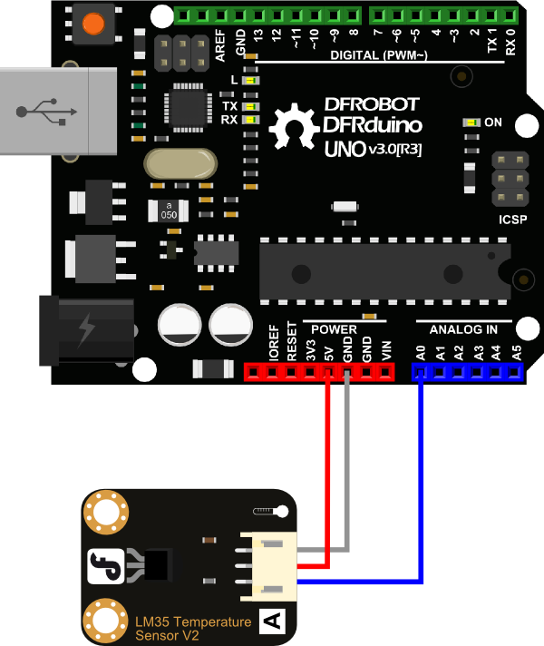
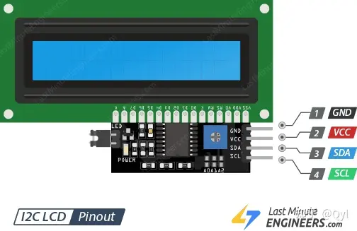
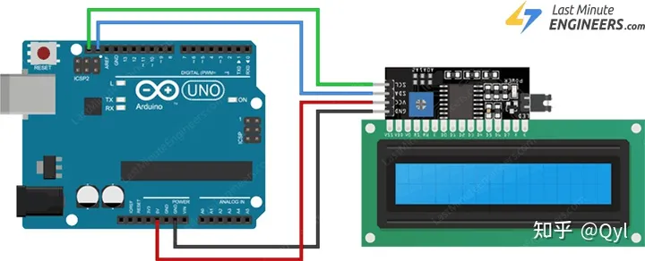
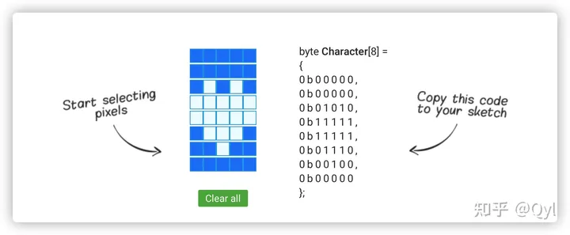
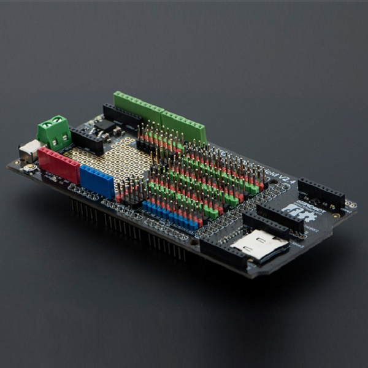
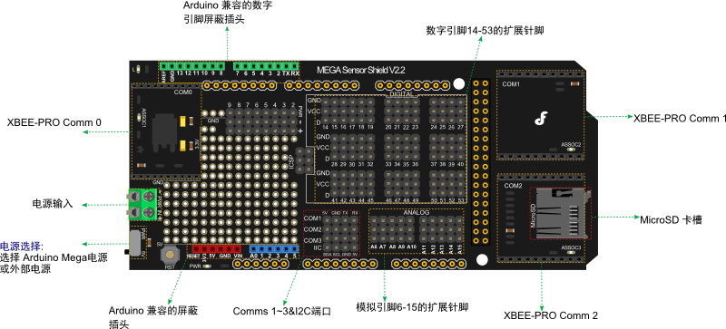

# Specification （温度传感器）
Sensor Chip Model: LM35  
Supply Voltage: 3.3~5.0V  
Sensor Chip Sensitivity: 10mV/℃  
Measuring Range: 0~150℃  
Precision: ±1℃  
Connector Type: PH2.0-3P  
Dimension: 30*22 mm  



```
void setup()
{
    Serial.begin(9600);//Set Baud Rate to 9600 bps
}

void loop()
{
    uint16_t val;
    double dat;
    val=analogRead(A0);//Connect LM35 on Analog 0
    dat = (double) val * (5/10.24);
    Serial.print("Tep:"); //Display the temperature on Serial monitor
    Serial.print(dat);
    Serial.println("C");
    delay(500);
}
```  

# DFR0063 I2C/TWI LCD1602 Module 液晶显示屏  
# [I2C LCD与Arduino接口](https://zhuanlan.zhihu.com/p/349791145)  

  
地线 是接地引脚，应连接到Arduino的地面。  
VCC为模块和LCD供电。将其连接到Arduino的5V输出或单独的电源。  
SDA是串行数据引脚。这条线用于发送和接收。连接到Arduino上的SDA引脚。  
SCL是串行时钟引脚。这是总线主设备提供的定时信号。连接到Arduino上的SCL引脚。  

# 接线方式  


`home()` –将光标放置在LCD的左上角而不清除显示。  
`cursor()` –显示LCD光标，在要打印的下一个字符的位置带有下划线（行）。  
`noCursor()` –隐藏LCD光标。  
`blink()` –创建闪烁的块样式LCD光标：在要打印的下一个字符的位置，闪烁的5×8像素矩形。  
`noBlink()` –禁用闪烁的块样式LCD光标。  
`display()` –打开LCD屏幕并显示以前在显示屏上打印的字符。  
`noDisplay()`–关闭液晶显示屏。仅关闭LCD屏幕并不会清除LCD存储器中的数据。这意味着将在调用display（）函数时再次显示它。  
`scrollDisplayLeft()`–将显示内容向左滚动一个空格。如果要连续滚动文本，则需要在循环内使用此功能。  
`scrollDisplayRight()` –将显示内容向右滚动一个空格。  
`autoscroll()`–打开LCD的自动滚动。如果当前文本方向是从左到右（默认），则显示向左滚动；如果当前方向是从右到左，则显示向右滚动。  
`noAutoscroll()` –关闭自动滚动。  

# CGROM和CGRAM自定义字符生成器  
  
[生成器](https://www.zhetao.com/fontarray.html)  

包含库并创建LCD对象后，将定义自定义字符数组。每个阵列由8个字节组成，对于5×8 led矩阵的每一行为1个字节。在此草图中，创建了8个自定义字符。  
让我们以`Heart[8]`数组为例。您会看到位如何形成实际上为0和1的心脏形状。0将关闭像素，而1将打开像素。  
```
byte Heart[8] = {
0b00000,
0b01010,
0b11111,
0b11111,
0b01110,
0b00100,
0b00000,
0b00000
};
```  
在设置中，使用该`createChar()`功能创建自定义字符。该函数有两个参数。第一个是0到7之间的数字，以保留8个受支持的自定义字符之一。第二个参数是字节数组的名称。  
```
lcd.createChar(0, Heart);
```  
在循环的下一步中，要显示自定义字符，请使用`write()`，并作为参数使用要显示的字符号。  
```
lcd.setCursor(0, 1);
lcd.write(0);
```

# DFR0165 Mega IO Expansion Shield For Arduino Mega  


## 产品参数
+ 兼容Arduino MEGA1280、Arduino MEGA2560、Arduino MEGA ADK、Google ADK  
+ 前半部分兼容Power shield、wifi shield、USB host shield、Motor shield等等  
+ 扩展40个数字 IO口（34个舵机接口）及电源  
+ 16个模拟IO口及电源  
+ 1个数字端口外接电源接线柱  
+ 1个数字端口外部供电和板载电源切换开关  
+ 1个ISP下载接口  
+ 3个串口外接接口  
+ 1个复位按钮  
+ 3个Xbee/Bluetooh Bee蓝牙无线数传接口  
+ 1个IIC/I2C/TWI接口  
+ 1个Micro SD卡插座  
+ 扩展面包孔若干  
+ 指示灯（PIN13）  
+ 平面尺寸：130x58mm  

## 引脚说明
  
<table>
<thead>
<tr>
<th><strong>引脚</strong></th>
<th><strong>功能</strong></th>
<th><strong>应用</strong></th>
</tr>
</thead>
<tbody><tr>
<td>D50</td>
<td>MISO</td>
<td>SPI接口</td>
</tr>
<tr>
<td>D51</td>
<td>MOSI</td>
<td>SPI接口</td>
</tr>
<tr>
<td>D52</td>
<td>SCK</td>
<td>SPI接口</td>
</tr>
<tr>
<td>D53</td>
<td>SS</td>
<td>SPI接口</td>
</tr>
<tr>
<td>D1</td>
<td>TX0</td>
<td>串口0</td>
</tr>
<tr>
<td>D0</td>
<td>RX0</td>
<td>串口0</td>
</tr>
<tr>
<td>D18</td>
<td>TX1</td>
<td>串口1</td>
</tr>
<tr>
<td>D19</td>
<td>RX1</td>
<td>串口1</td>
</tr>
<tr>
<td>D16</td>
<td>TX2</td>
<td>串口2</td>
</tr>
<tr>
<td>D17</td>
<td>RX2</td>
<td>串口2</td>
</tr>
<tr>
<td>D14</td>
<td>TX3</td>
<td>串口3</td>
</tr>
<tr>
<td>D15</td>
<td>RX3</td>
<td>串口3</td>
</tr>
<tr>
<td>D20</td>
<td>SDA</td>
<td>IIC接口</td>
</tr>
<tr>
<td>D21</td>
<td>SCL</td>
<td>IIC接口</td>
</tr>
<tr>
<td>D4</td>
<td>PG5_SS</td>
<td>用SD卡时使用</td>
</tr>
<tr>
<td>D13</td>
<td>LED</td>
<td>数字针脚</td>
</tr>
</tbody></table>

# Micro SD  
[Mirco SD](https://zhuanlan.zhihu.com/p/349832403)